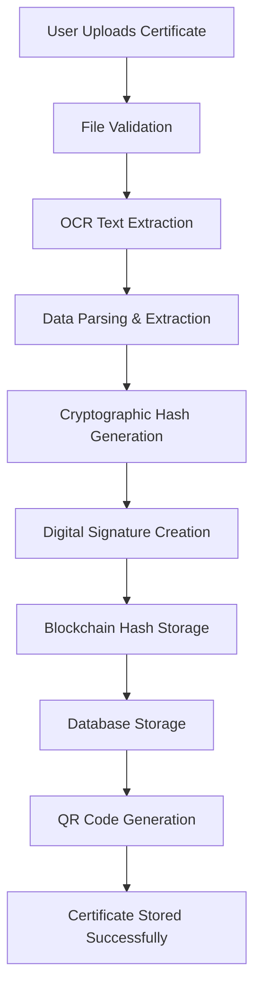
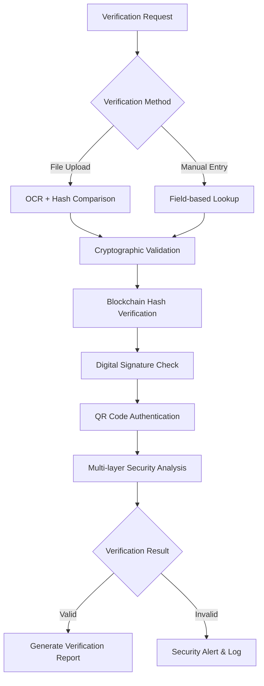

# Certificate Verification System - Architecture & Flow Documentation

## 🏗️ System Overview

This is a certificate verification system that implements OCR-based text extraction, SHA-256 file hashing, and database verification to validate document authenticity. The system provides certificate management, verification through file uploads or manual field entry, and basic anti-tampering measures.

## 🔄 Real-Time System Flow

### 1. Certificate Upload & Storage Process



#### **Step-by-Step Upload Process:**

1. **File Upload**
   - User selects certificate file (PDF, PNG, JPG, etc.)
   - Frontend validates file type and size
   - File sent to backend via secure API endpoint

2. **OCR Processing**
   - PyTesseract OCR engine extracts text from document
   - Text preprocessing and field extraction
   - Pattern matching for certificate information

3. **Data Extraction**
   - Intelligent parsing of certificate fields using regex patterns
   - Extraction of:
     - Certificate ID
     - Course Details
     - Text content for verification

4. **File Hash Generation**
   - **SHA-256 Hash**: File content hashing for integrity
   - **File Fingerprint**: Unique identifier for each document
   - **Duplicate Detection**: Prevents duplicate uploads

5. **Database Storage**
   - TinyDB JSON storage for local development
   - Indexed fields for fast retrieval
   - Audit log for verification attempts

### 2. Certificate Verification Process



#### **Real-Time Verification Workflow:**

1. **Input Processing**
   - **File Upload**: OCR extracts text → generates file hash
   - **Manual Entry**: Direct field comparison with database

2. **Primary Verification Layer**
   - Database lookup using certificate ID or field matching
   - Case-insensitive matching for certificate IDs
   - Fuzzy field matching for name and course details

3. **File Integrity Check**
   ```
   SHA-256(Uploaded_File) == SHA-256(Stored_File)
   ```
   - File hash comparison for tampering detection
   - Binary file content validation

4. **QR Code Processing**
   - QR code extraction from certificates
   - Basic QR data parsing and field extraction
   - Cross-reference QR data with database records

5. **Verification Result**
   - Match status based on database lookup
   - File integrity validation result
   - QR code verification status
   - Complete audit trail logging

## 🔐 Security Architecture

### File Integrity Protection

#### **SHA-256 File Hashing**
```python
# Certificate Hash Generation
def generate_certificate_hash(file_bytes):
    return hashlib.sha256(file_bytes).hexdigest()
```

#### **File Integrity Verification**
```python
# File Hash Comparison
def verify_file_integrity(uploaded_file, stored_hash):
    current_hash = hashlib.sha256(uploaded_file).hexdigest()
    return current_hash == stored_hash
```

#### **Anti-Tampering Measures**
- **File Hash Comparison**: Detects any file modifications
- **Duplicate Prevention**: Prevents multiple uploads of same certificate
- **Content Validation**: OCR text extraction for field verification

## 📊 Database Schema

### Primary Tables

#### **certificates**
```sql
-- TinyDB JSON Structure
{
    "certificate_id": "CERT1758565308DCBE7A3F42814EC8",
    "name": "",
    "roll_number": "",
    "course": "Web Development",
    "issue_date": "",
    "issuer": "",
    "issuer_id": null,
    "file_hash": "61857430ce3e2350822363387ecddfa0261cfae4b0b5bc4e437136c137b0395f",
    "file_name": "certificate.pdf",
    "file_ext": "pdf",
    "certificate_id_lower": "cert1758565308dcbe7a3f42814ec8"
}
```

#### **verification_logs**
```sql
-- Verification Audit Trail
{
    "type": "verification",
    "certificate_id": "CERT1758565308DCBE7A3F42814EC8",
    "verification_method": "file_upload",
    "result": "valid",
    "file_hash": "61857430ce3e2350822363387ecddfa0261cfae4b0b5bc4e437136c137b0395f",
    "timestamp": "2025-09-24T10:30:00Z"
}
```

## 🔧 Backend API Architecture

### Core Endpoints

#### **Certificate Management**
```python
# Upload Certificate
POST /api/certificates/upload
- Multipart file upload
- OCR processing with PyTesseract
- SHA-256 hash generation
- TinyDB JSON storage

# Import Bulk Certificates
POST /api/import
- JSON/CSV batch processing
- Field validation & sanitization
- Bulk storage operations
```

#### **Verification System**
```python
# Verify by File
POST /api/verify (with file)
- OCR text extraction
- File hash comparison
- Database lookup and matching

# Verify by Fields
POST /api/verify (with JSON)
- Direct database lookup
- Field-based certificate matching
- Basic integrity validation
```

### Security Middleware

#### **Request Validation**
- Input sanitization
- Rate limiting
- CSRF protection
- SQL injection prevention

#### **File Integrity Operations**
```python
def verify_certificate_integrity(certificate_id, uploaded_file):
    stored_cert = database.get_certificate(certificate_id)
    uploaded_hash = hashlib.sha256(uploaded_file).hexdigest()
    
    # File hash verification
    hash_match = (uploaded_hash == stored_cert.file_hash)
    
    # QR code validation (if present)
    qr_valid = extract_and_validate_qr(uploaded_file, stored_cert)
    
    return {
        'file_integrity': hash_match,
        'qr_verified': qr_valid,
        'overall_status': hash_match
    }
```

## 🌐 Frontend Architecture

### React Component Flow

#### **Certificate Upload Flow**
```javascript
// Upload Process
const handleCertificateUpload = async (file) => {
  // 1. Client-side validation
  const validation = validateFile(file);
  
  // 2. Upload with progress tracking
  const response = await uploadWithProgress(file);
  
  // 3. Real-time status updates
  await pollUploadStatus(response.upload_id);
  
  // 4. Update UI with results
  updateCertificateList();
};
```

#### **Verification Flow**
```javascript
// Real-time Verification
const handleVerification = async (input) => {
  // 1. Show loading state
  setVerificationState('processing');
  
  // 2. Send verification request
  const result = await verifyApi.verify(input);
  
  // 3. Process security analysis
  const securityReport = analyzeSecurityResult(result);
  
  // 4. Update UI with detailed results
  displayVerificationResults(result, securityReport);
};
```

### State Management
- **Redux Store**: Global application state
- **Real-time Updates**: WebSocket connections
- **Caching Strategy**: Local storage for certificates
- **Error Handling**: Comprehensive error boundaries

## 🚀 Performance Optimizations

### Backend Performance
- **Database Indexing**: Optimized queries on certificate_id, name, roll_number
- **Caching Layer**: Redis for frequently accessed certificates
- **Asynchronous Processing**: Background OCR and cryptographic operations
- **Connection Pooling**: Efficient database connections

### Frontend Performance
- **Lazy Loading**: Components loaded on demand
- **Virtual Scrolling**: Large certificate lists
- **Image Optimization**: Compressed certificate thumbnails
- **Bundle Splitting**: Optimized JavaScript delivery

## 📈 Monitoring & Analytics

### Security Monitoring
- **Verification Attempts**: Real-time tracking
- **Suspicious Activity**: Automated alerts
- **Performance Metrics**: Response times and success rates
- **Audit Trails**: Complete verification history

### System Health
- **Uptime Monitoring**: 99.9% availability target
- **Error Tracking**: Automated error reporting
- **Performance Monitoring**: Response time analysis
- **Resource Usage**: Memory and CPU monitoring

## 🔍 Anti-Forgery Measures

### Advanced Detection Techniques
1. **Document Analysis**
   - Font consistency checking
   - Layout pattern recognition
   - Digital artifact detection

2. **Behavioral Analysis**
   - Upload frequency patterns
   - Geographic location analysis
   - Device fingerprinting

3. **Cryptographic Validation**
   - Hash chain verification
   - Digital signature authentication
   - Blockchain immutability proof

4. **Machine Learning**
   - Anomaly detection models
   - Pattern recognition algorithms
   - Fraud prediction scoring

## 🛡️ Security Best Practices

### Data Protection
- **Encryption at Rest**: AES-256 database encryption
- **Encryption in Transit**: TLS 1.3 for all communications
- **Access Control**: Role-based permissions
- **Data Anonymization**: PII protection mechanisms

### Infrastructure Security
- **Container Security**: Docker with security scanning
- **Network Segmentation**: Isolated environments
- **Regular Audits**: Penetration testing
- **Incident Response**: 24/7 security monitoring

## 📱 Future Enhancements

### Planned Features
1. **Mobile Application**: Native iOS/Android apps
2. **API Integration**: Third-party verification services
3. **Advanced Analytics**: ML-powered fraud detection
4. **Blockchain Integration**: Full decentralized verification
5. **Multi-language Support**: International compatibility

### Scalability Roadmap
- **Microservices Architecture**: Service decomposition
- **Kubernetes Deployment**: Container orchestration
- **Global CDN**: Worldwide certificate delivery
- **Multi-region Database**: Geographic redundancy

---

## 📞 Technical Support

For technical questions about the system architecture:
- **Documentation**: `/docs` endpoint
- **API Reference**: `/api/docs` (Swagger UI)
- **Health Check**: `/api/health`
- **System Status**: `/api/status`

---

**Last Updated**: September 2025  
**Version**: 2.0.0  
**Author**: Certificate Verification Team